# Manga feelings: Sentiment analysis of webtoon comments
*Git repo for WEM project*

- [Manga feelings: Sentiment analysis of webtoon comments](#manga-feelings-sentiment-analysis-of-webtoon-comments)
  - [1. Context](#1-context)
  - [2. Data](#2-data)
    - [Description](#description)
    - [Sources](#sources)
    - [Quantity](#quantity)
    - [Preprocessing](#preprocessing)
      - [Scraping data](#scraping-data)
      - [Data cleaning](#data-cleaning)
      - [Dataframe with sentimental analysis](#dataframe-with-sentimental-analysis)
  - [3. State of the art](#3-state-of-the-art)
  - [4. Conception / Cas d'utilisation / Architecture](#4-conception--cas-dutilisation--architecture)
  - [5. Fonctionnalités](#5-fonctionnalités)
    - [Visualisation](#visualisation)
  - [6. Techniques, algorithmes et outils utilisés](#6-techniques-algorithmes-et-outils-utilisés)
    - [Scripts](#scripts)
    - [Scraping](#scraping)
    - [Data Cleaning](#data-cleaning-1)
    - [Sentimental Analysis](#sentimental-analysis)
    - [Rating Prediction](#rating-prediction)
    - [Visualisation](#visualisation-1)
  - [7. Planification, organisation et suivi répartition du travail (diagramme de Gantt)](#7-planification-organisation-et-suivi-répartition-du-travail-diagramme-de-gantt)
  - [8. Conclusion / Improvements](#8-conclusion--improvements)
    - [Conclusion](#conclusion)
      - [Scraping](#scraping-1)
      - [Data cleaning](#data-cleaning-2)
      - [Sentiment analysis](#sentiment-analysis)
      - [Rating Prediction](#rating-prediction-1)
    - [Improvements](#improvements)
      - [Scraping](#scraping-2)
      - [Rating Prediction](#rating-prediction-2)
      - [Data cleaning](#data-cleaning-3)
      - [Visualisation](#visualisation-2)


## 1. Context

This project performs sentiment analysis on the comments of a serie of webtoons then use different feature to try to predict the user rating given on the same website. We will first scrap all the comment on each episode. Then make a sentiment analysis on them. Finally we will display some extract and try to predict the user rating.

The website is quite well formated with the same presentation for each webtoon(comics). There is a comment section on each episode. There is also a like counter for each episode. These two infos aka features could give an indication about the quality of the webtoon and should be linked with the user rating (1-10) on the webtoon.

## 2. Data

### Description

The data is made of the comments and reply of a serie of webtoons. 
### Sources
We scrapped all the comments and replies (up to 2023-05-18) from the following webtoons:
- [How to be a dragon](https://www.webtoons.com/en/challenge/how-to-be-a-dragon/list?title_no=696410)
- [Nerd and Jock](https://www.webtoons.com/en/challenge/nerd-and-jock/list?title_no=135963)
- [Seeker's log](https://www.webtoons.com/en/challenge/seekers-log/list?title_no=102095)
- [Power Pills](https://www.webtoons.com/en/challenge/power-pills/list?title_no=18222)
- [A life through selfies](https://www.webtoons.com/en/challenge/a-life-through-selfies/list?title_no=64761)
- [Goth girl the jock](https://www.webtoons.com/en/challenge/goth-girl-the-jock/list?title_no=764411)
- [Weak Hero](https://www.webtoons.com/en/action/weakhero/list?title_no=1726)
- [My husband changes every night](https://www.webtoons.com/en/fantasy/my-husband-changes-every-night/list?title_no=5214)

### Quantity
|                      series_name  | episodes |
|----------------------------------|----------------------|
|          A Life Through Selfies  |                  316 |
|              Goth Girl The Jock  |                   32 |
|              How To Be A Dragon  |                   36 |
|  My Husband Changes Every Night  |                    5 |
|                   Nerd And Jock  |                  198 |
|                     Power Pills  |                  477 |
|                     Seekers Log  |                  168 |
|                        Weakhero  |                  240 |

There is a total of 1472 episodes and 542 csv files with an aprox size of 280 Mo which are not clean yet. Some of this files were aggregated in a single csv per webtoon to be able to work with them.

### Preprocessing

#### Scraping data
The data after we completed the scraping looks like this:
<div style="overflow-x: auto;">
    
| Episode_URL_level1 | Episode_Name_level1 | Episode_Likes_level1 | Episode_Date_level1 | Comment_ID_level1 | Comment_Reply_Level_level1 | Comment_Parent_Comment_No_level1 | Comment_Text_level1 | Comment_Date_level1 | Comment_Author_level1 | Comment_Likes_level1 | Comment_Dislikes_level1 |
| ------------------ | ------------------- | -------------------- | -------------------- | ----------------- | --------------------------- | -------------------------------- | -------------------- | -------------------- | --------------------- | --------------------- | ----------------------- |
| https://www.webtoons.com/en/action/weakhero/ep-1/viewer?title_no=1726&episode_no=1 | Ep. 1 | 136613 | Sep 10, 2019 | 94679831 | 1 | 94679831 | Lookism and Unordinary vibes!!!! | 2019-09-10T09:13:50+0900 | A3Dean | 56699 | 752 |
| https://www.webtoons.com/en/action/weakhero/ep-1/viewer?title_no=1726&episode_no=1 | Ep. 1 | 136613 | Sep 10, 2019 | 94680132 | 2 | 94679831 | the looks remind me of sweet home | 2019-09-10T09:18:40+0900 | Noimnottiktokfamous | 597 | 11 |
| https://www.webtoons.com/en/action/weakhero/ep-1/viewer?title_no=1726&episode_no=1 | Ep. 1 | 136613 | Sep 10, 2019 | 94680531 | 2 | 94679831 | they're at the bottom where it says if you like this one read these other ones | 2019-09-10T09:24:17+0900 | Miss Youtube Lover | 281 | 4 |
| https://www.webtoons.com/en/action/weakhero/ep-1/viewer?title_no=1726&episode_no=1 | Ep. 1 | 136613 | Sep 10, 2019 | 94680913 | 2 | 94679831 | Okay hold up, at first it said the kid at the beginning was in middle school (What is this, JOJO?!?) And then the “loser” guy said he was randomly enrolled in a highschool?! NANI?!? | 2019-09-10T09:30:00+0900 | ┬┴┬┴┤ ✧≖ ͜ʖ≖) -... | 175 | 30 |

</div>

#### Data cleaning

Cleaning:
- Columns : We drop the columns that contain duplicated data and rename it without flourish. We renamed some columns to have a more clear name.
- Dates : We use the generic format ISO8601 to have a consist time marker.
- Genres : We manually add the genre as it could be interesting to know the differences between them.
- Episode ID : We used the id provided in the url to identify each episode
- Series name : We added the series name
- Series views : We added the total views of the series
- Series subscribers : We added the total subscribers of the series
- Series rating : We added the rating of the series
- We dropped the duplicated rows

The cleaned data looks like this:
<div style="overflow-x: auto;">
   
| series_genre | series_name | series_views | series_subscribers | series_rating | episode_ID_number | Episode_Name | Episode_URL | Episode_Date | Episode_Likes | Comment_ID | Comment_Text | Comment_Date                | Comment_Author    | Comment_Likes | Comment_Dislikes | Reply_ID   | Reply_to_Comment_ID | Reply_Text                                    | Reply_Date                 | Reply_Author   | Reply_Likes | Reply_Dislikes |
|--------------|-------------|--------------|--------------------|---------------|-------------------|--------------|--------------|---------------|---------------|------------|--------------|-----------------------------|-------------------|---------------|------------------|------------|---------------------|-----------------------------------------------|----------------------------|----------------|--------------|----------------|
| Action       | Weakhero    | 216300000    | 1400000            | 9.84          | 100               | Ep. 100      | https://www.webtoons.com/en/action/weakhero/ep-100/viewer?title_no=1726&episode_no=100  | 01.09.2020    | 81653         | 129697318  | I’m so glad Gray has grown and found peace for himself while still holding onto the memory of Stephen | 2020-08-11 10:01:31+09:00 | WillowLikesToDraw | 49374         | 38               | 132769823  | 129697318           | same                                          | 2020-09-01 12:15:41+09:00 | FruitInABasket | 11           | 0              |
| Action       | Weakhero    | 216300000    | 1400000            | 9.84          | 100               | Ep. 100      | https://www.webtoons.com/en/action/weakhero/ep-100/viewer?title_no=1726&episode_no=100  | 01.09.2020    | 81653         | 129700425  | I’m glad to see he’s able to overcome his rooftop trauma. Side note: Gray keeping any item on him for extra weapons in his arsenal now 😂   | 2020-08-11 10:13:38+09:00 | TRUEHAWAIIAN       | 2236          | 5                | 129711567  | 129700425           | nah that's not a weapon it's the clip Stephen gave him | 2020-08-11 10:54:49+09:00 | Jamrar         | 262          | 1              |
| Action       | Weakhero    | 216300000    | 1400000            | 9.84          | 100               | Ep. 100      | https://www.webtoons.com/en/action/weakhero/ep-100/viewer?title_no=1726&episode_no=100  | 01.09.2020    | 81653         | 129698199  | Donald is playing 4D chess                                                                         | 2020-08-11 10:05:01+09:00 | Finanov           | 1414          | 2                | 132775449  | 129698199           | Is no one going to talk about the fact that the man was doing Trig homework in an executive office that belonged to him with a Van Gogh in the back?!?! Like if that ain't a power move 😳 | 2020-09-01 13:01:39+09:00 |

</div>

#### Dataframe with sentimental analysis
We added the sentimental analysis columns to the dataframe. Its 162 Mo. 433870 rows × 29 columns.

The final dataframe will look like this:
<div style="overflow-x: auto;">
    
| series_genre | series_name | series_views | series_subscribers | series_rating | episode_ID_number | Episode_Name | Episode_URL | Episode_Date | Episode_Likes | Comment_ID | Comment_Text | Comment_Date | Comment_Author | Comment_Likes | Comment_Dislikes | Reply_ID | Reply_to_Comment_ID | Reply_Text | Reply_Date | Reply_Author | Reply_Likes | Reply_Dislikes | SA_label_reply_text | SA_score_reply_text | SA_label_comment_text | SA_score_comment_text | Sentiment_Score_comment | Sentiment_Score_reply |
| --- | --- | --- | --- | --- | --- | --- | --- | --- | --- | --- | --- | --- | --- | --- | --- | --- | --- | --- | --- | --- | --- | --- | --- | --- | --- | --- | --- | --- |
| Sci-fi/Drama | Seekers Log | 3100000 | 35517 | 9.55 | 160 | Ep. 132 | https://www.webtoons.com/en/challenge/seekers-log/ep-132/viewer?title_no=102095&episode_no=160 | 2022-03-07 | 628 | 199217820 | I hope it's not sus, but it looks super sus so far! | 2022-03-08 10:12:37+09:00 | hyperknux | 37 | 0 | nan | nan | nan | nan | nan | nan | nan | nan | 0.0 | neutral | 0.5634765625 | 0.0 | nan |
| Romance/Drama | Goth Girl The Jock | 31200000 | 643531 | 9.51 | 8 | Ep. 8 - Whatever... | https://www.webtoons.com/en/challenge/goth-girl-the-jock/ep-8-whatever/viewer?title_no=764411&episode_no=8 | 2022-07-07 | 58245 | 210223131 | Awww nooo. It’s just a misunderstanding, he doesn’t really mean that :( | 2022-07-08 03:01:36+09:00 | Your God Rose | 11289 | 40 | 214073286.0 | 210223131.0 | it was his choice what to say and he didn't mean any harm by it | 2022-08-25 15:10:39+09:00 | Asuna Sakamaki | 1.0 | 0.0 | negative | 0.84423828125 | negative | 0.86865234375 | -0.86865234375 | -0.84423828125 |
| Superhero/Comedy | Power Pills | 12500000 | 57465 | 8.57 | 314 | Pages 664-666: Kristy's Powers | https://www.webtoons.com/en/challenge/power-pills/pages-664-666-kristys-powers/viewer?title_no=18222&episode_no=314 | 2020-09-13 | 1881 | 134473560 | wait wait wait there was purple lighting! purple pill next? | 2020-09-14 03:25:15+09:00 | Eggz.yay | 588 | 2 | 134880137.0 | 134473560.0 | red is probably after purple I think. I think red is speed | 2020-09-17 05:48:26+09:00 | ♡~sᴏᴜʟ~♡ | 1.0 | 0.0 | neutral | 0.88037109375 | neutral | 0.771484375 | 0.0 | 0.0 |
| Superhero/Comedy | Power Pills | 12500000 | 57465 | 8.57 | 274 | Victory Ice Cream | https://www.webtoons.com/en/challenge/power-pills/victory-ice-cream/viewer?title_no=18222&episode_no=274 | 2020-02-23 | 1687 | 107360514 | YOOO THE ART STYLE IS SO CUTE | 2020-02-24 04:44:44+09:00 | Linnea4president Yep | 4 | 0 | nan | nan | nan | nan | nan | nan | nan | nan | 0.0 | positive | 0.935546875 | 0.935546875 | nan |
| Action | Weakhero | 216300000 | 1400000 | 9.84 | 99 | Ep. 99 | https://www.webtoons.com/en/action/weakhero/ep-99/viewer?title_no=1726&episode_no=99 | 2020-08-27 | 83571 | 132033290 | I would ship but like THIS IS TOO GOOD OF A FRIENDSHIP AHHHHH *cries quietly to self* | 2020-08-27 10:49:39+09:00 | Nightshade Glori | 4 | 0 | nan | nan | nan | nan | nan | nan | nan | nan | 0.0 | positive | 0.89892578125 | 0.89892578125 | nan |

</div>

## 3. State of the art

Sentiment analysis, also known as opinion mining, is a computational technique that aims to determine and understand the sentiment or subjective information expressed in textual data. It involves analyzing and classifying text to identify the overall sentiment as positive, negative, or neutral.

The goal of sentiment analysis is to extract and quantify subjective information from various sources such as social media posts, customer reviews, news articles, and surveys. By automatically determining the sentiment in a large volume of text, sentiment analysis can provide valuable insights for businesses, researchers, and organizations.

Sentiment analysis techniques leverage natural language processing (NLP) and machine learning algorithms to process and interpret text. These techniques involve several steps, including preprocessing the text by removing noise, tokenizing the text into individual words or phrases, and assigning sentiment scores or labels to each token.

Lexicon-based methods use sentiment dictionaries or word lists containing predefined sentiment scores to classify text based on the presence and polarity of sentiment words. Rule-based systems utilize handcrafted rules to identify sentiment patterns and make sentiment predictions.

Machine learning approaches in sentiment analysis involve training models on labeled datasets, where texts are annotated with sentiment labels. Algorithms such as Naive Bayes, Support Vector Machines (SVM), and Random Forests learn patterns from the labeled data to predict sentiment in new, unseen text. Feature engineering techniques, such as bag-of-words, n-grams, and word embeddings, are used to represent the text and capture relevant information for sentiment classification.

Deep learning techniques, particularly recurrent neural networks (RNNs), convolutional neural networks (CNNs), and transformer models, have shown remarkable success in sentiment analysis. These models can capture contextual information, long-term dependencies, and complex relationships within the text, resulting in improved sentiment classification accuracy.

Sentiment analysis has various applications, including brand monitoring, social media analysis, customer feedback analysis, market research, and public opinion analysis. It enables businesses to understand customer sentiments, identify trends, and make informed decisions to improve products, services, and customer experiences.

Despite the advancements in sentiment analysis, challenges remain, such as handling sarcasm, irony, and cultural nuances, as well as addressing bias and ensuring fairness in sentiment analysis models. Ongoing research aims to tackle these challenges and further enhance the accuracy and robustness of sentiment analysis techniques.

## 4. Conception / Cas d'utilisation / Architecture

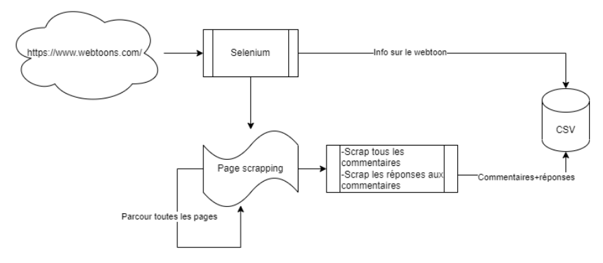

We'll use Selenium to create a driver that browses the pages and retrieves info from the webtoon's front page. It then browses the chapters, saving the comments and their responses in a CSV file.

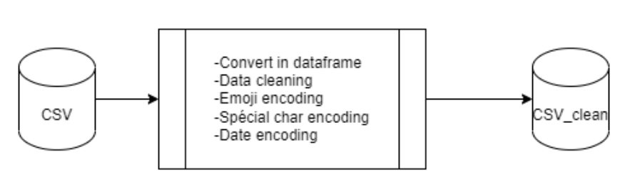

We'll need to prepare the data (probably with pandas) to handle special encoding cases (emoji/special char/format date/...). Then save in another clean CSV.

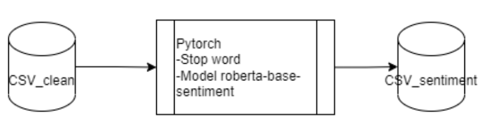

Once the data has been cleaned, we'll use Pytorch with a model that handles emojis (twitter model), with the basic English language set as stopword.


Finally, the data are used to create interactive figures using plotly. Those figures are then added on a dashboard created using plotly dash.


## 5. Fonctionnalités 

### Visualisation
The provided script `dashboard.py` creates a dashboard that displays interactive graphs based on data we gathered scraping. Here's a summary of the functionalities offered by the dashboard and its interactive graphs:

  - Genre Selection:

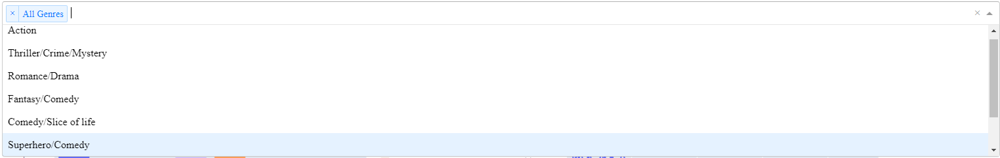

The dropdown menu allows you to select one or more genres to filter the data and update the displayed graphs accordingly.
The "All Genres" option is available to view the graphs for all genres simultaneously.
Please note that the dashboard provides an interactive interface where you can dynamically explore and analyze the data based on your genre selections. The graphs are updated in real-time when you make a selection in the dropdown menu, allowing for a flexible and customizable visual representation of the data.

  - Average Likes per Genre:

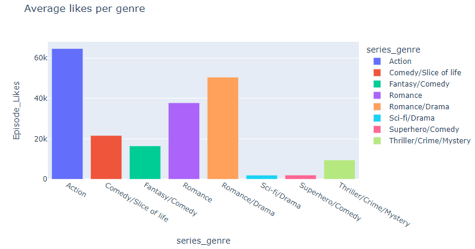

The bar chart shows the average number of likes per genre.

  - Likes per Episode:

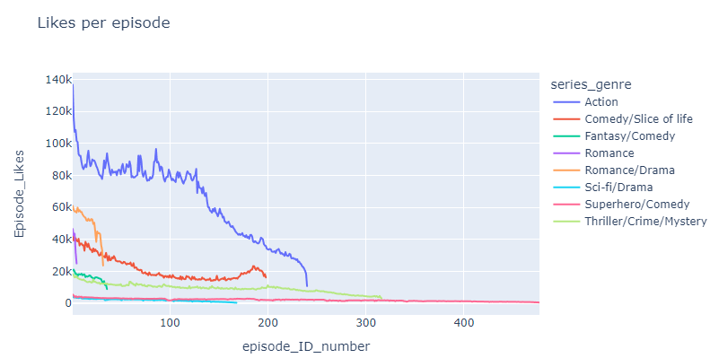

The line chart displays the number of likes per episode for each genre.


  - Percentage of Likes compared to the First Episode:

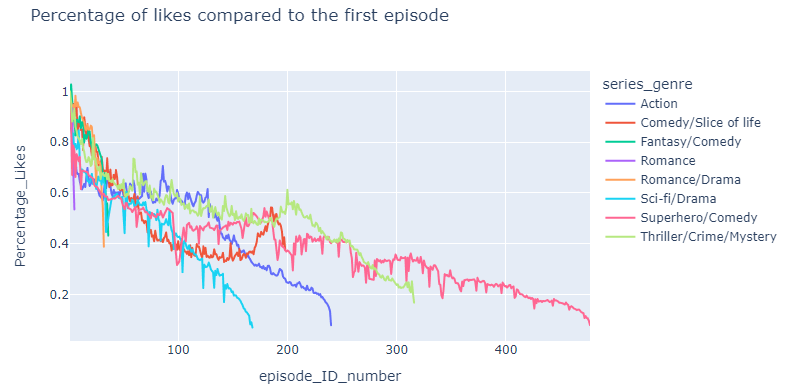

The line chart illustrates the percentage of likes compared to the first episode for each genre.
It allows you to observe the trend in audience engagement over episodes.


  - Sentiment Score per Genre:

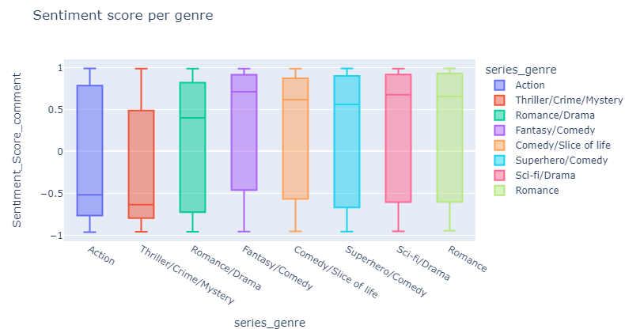

The box plot presents the distribution of sentiment scores for comments within each genre.
It helps in understanding the sentiment of comments associated with different genres.


## 6. Techniques, algorithmes et outils utilisés 
### Scripts

We used 5 juypter notebook to perform the analysis:
- `01_scrap_selenium.ipynb`: This script performs the scraping of the comments and replies from the webtoon. The output is a csv file for each webtoon for each episode.
- `02_tidy_data.ipynb`: This script will join all the csv and prepare the data to be processed.
- `03_sentimental_analysis.ipynb`: This script will perform the sentimentall analysis on the comments and replies.
- `04_rating_prediction.ipynb`: This script will predic the note of the webtoon based on sentiment
- `05_visualisation.ipynb`: This script will compute the data and result into graphs

### Scraping
`01_scrap_selenium.ipynb` is the notebook we used for performing the scraping of the data. We tried multiple libraries for scraping, but we found that Selenium was the most suitable for our use case. It allowed us to automate the process of opening the webtoon page, clicking on the "next page" button, and scrolling to the bottom of the page to load all the comments. It also allowed us to open the replies to each comment and scrape them as well.

Libraries used:
- `selenium`: A library for automating web browsers.
- `pandas`: A powerful data manipulation and analysis library.
- `polars`: An alternative to pandas written in Rust that provides better performance.
- `tqdm`: A library for adding progress bars to Python code.
- `time`: A library for measuring time in Python.
- `os`: A library for interacting with the operating system.
- `urrlib`: A library for opening URLs.

The script performs the following steps for a given webtoon:

1. The input needed for the scraping are the url of the main page of the webtoon we want and the number of pages we want to scrape.
      ```shell
      url_list = [
          {"url": "https://www.webtoons.com/en/action/weakhero/list?title_no=1726", "min_page": 1, "max_page": 24},
          {"url": "https://www.webtoons.com/en/challenge/how-to-be-a-dragon/list?title_no=696410", "min_page": 1, "max_page": 4},
      ```
The reason for the `min_page` and `max_page` is maybe we want to only scrape the first pages of the webtoon. This is useful for testing the script on a small sample of data before running it on the whole webtoon.

2. Now we can use Selenium WebDriver to navigate to the series page and extract the information for each episode. We will by using the css selector to get the information we want. The result is a list of episodes with the following information:
    - Episode name
    - Episode url
    - Episode likes
    ```shell
    def extract_episodes_info(driver, main_url, min_page, max_page):

        episodes_info = []

        for page_num in range(min_page, max_page + 1):
            if page_num == min_page:
                page_url = f"{main_url}&page={page_num}?lang=en"
            else:
                page_url = f"{main_url}&page={page_num}"
            
            driver.get(page_url)

            episode_items = driver.find_elements(By.CSS_SELECTOR, 'li._episodeItem')

            for episode_item in episode_items:
                episode_name = episode_item.find_element(By.CSS_SELECTOR, 'span.subj').text.strip()
                episode_url = episode_item.find_element(By.CSS_SELECTOR, 'a').get_attribute('href')
                # episode likes
                likes_text = episode_item.find_element(By.CSS_SELECTOR, 'span.like_area').text.strip()
                likes_text = likes_text.replace(",", "")  # Remove commas
                episode_likes = int(re.search(r'\d+', likes_text).group())  # Extract the number and convert it to an integer
                episode_date = episode_item.find_element(By.CSS_SELECTOR, 'span.date').text.strip()

                episodes_info.append({
                    'name': episode_name,
                    'url': episode_url,
                    'likes': episode_likes,
                    'date': episode_date
                })

        return episodes_info
      ```

3. For each episode url:
    - Open the url
    - Go to the bottom of the page. The site is dynamically loaded, so we need to scroll to the bottom of the page to load all the parts of the page.
    - Check if there is a reply to every comment in the page. If there is a reply, we will click on the button to open the replies.
    - Scrape all the comments and replies. Here we are going to use beautifoulsoup to download the entire site and extract the information we want parsing the html.
    ```shell
    soup = BeautifulSoup(driver.page_source, 'html.parser')
    comments = soup.select('.u_cbox_comment')

    comment_data = []

    for comment in comments:
        data_info = comment['data-info']
        data_info = data_info.replace("'", "").replace(" ", "")
        data_info_dict = dict(item.split(":") for item in data_info.split(",") if ":" in item)

        comment_id = data_info_dict.get('commentNo')
        reply_level = data_info_dict.get('replyLevel')
        parent_comment_no = data_info_dict.get('parentCommentNo')
        comment_text = comment.select_one('.u_cbox_contents').text
        comment_date = comment.select_one('.u_cbox_date')['data-value']
        comment_author = comment.select_one('.u_cbox_nick').text

        # Extract likes and dislikes
        likes = comment.select_one('.u_cbox_tool .u_cbox_cnt_recomm').text if comment.select_one('.u_cbox_tool .u_cbox_cnt_recomm') else "0"
        dislikes = comment.select_one('.u_cbox_tool .u_cbox_cnt_unrecomm').text if comment.select_one('.u_cbox_tool .u_cbox_cnt_unrecomm') else "0"

        comment_data.append([episode_url, episode_name, episode_likes, episode_date,\
                             comment_id, reply_level, parent_comment_no, comment_text, comment_date, comment_author, likes, dislikes])
      ```
    - Close all the replies button. This is a necessary step to avoid problems with Selenium. The "next button" in the reply are called the same as the "next button" in the comments. So if we don't close the replies button, Selenium will click on the reply button instead of the comment button.
    - Go to the next page of comments and repeat until there is no more pages

4. Now we have all the comments and replies for each episode. We are using the function `format_and_save_to_csv`. The column names are:
    ```shell
    column_names = [
      "Episode_URL", "Episode_Name", "Episode_Likes", "Episode_Date",
      "Comment_ID", "Comment_Reply_Level", "Comment_Parent_Comment_No",
      "Comment_Text", "Comment_Date", "Comment_Author",
      "Comment_Likes", "Comment_Dislikes",
    ]
    ```
    The `"Comment_Reply_Level"` indicates if a comment is a reply (level 2) or a comment (level 1). The `"Comment_Parent_Comment_No"` indicates the comment id of the comment that the reply belongs to.
    The next step is to merge the dataframe on the left on the comments (level 1) and on the right the replies (level 2)
    ```shell
                    merged_df = pd.merge(
                        merged_df,
                        df_level,
                        left_on='Comment_ID_level{}'.format(level - 1),
                        right_on='Comment_Parent_Comment_No_level{}'.format(level),
                        suffixes=('_level{}'.format(level - 1), '_level{}'.format(level)),
                        how='left'
    ```

5. Save the dataframe to a csv file. There will be a cvs for each episode.

### Data Cleaning
The notebook used is `02_tidy_data.ipynb`. We will be merging all the data we have scraped into one dataframe. Then we are going to clean it and prepare it for the Sentimental analysis.

Libraries Used:
- `pandas`: A powerful data manipulation and analysis library.
- `os`: The OS module in Python provides functions for interacting with the operating system.
- `glob`: The glob module finds all the pathnames matching a specified pattern according to the rules used by the Unix shell.
- `polars`: Polars is a blazingly fast data processing library in Rust and Python
- `datetime`: The datetime module supplies classes for manipulating dates and times.
- `zipfile`: The zipfile module provides a simple interface to creating and reading ZIP files.

Data cleaning steps:
1. Read all the csv files into the download directory and merge them into one dataframe. For this step we are going to use `polars` library. Using `pandas` will take a lot of time and memory.

2. Drop all the duplicates. Sometimes there are some comments that are repeated because we have downloaded the same episode at different dates.

3. Rename the columns to a more readable format.

4. Parse the url `https://www.webtoons.com/en/challenge/how-to-be-a-dragon/its-here/viewer?title_no=696410&episode_no=37` to get:
    - Series name `How to be a Dragon`
    - Episode ID number `37`

5. We are using data manually added (dict) to create new columns for:
    - `Series_Genre`: The genre of the series
    - `Series_Views`: The number of views of the series
    - `Series_Subscribers`: The number of subscribers of the series
    - `Series_Rating`: The rating of the series

6. Clean dates, rename columns, reorder the dataframe. Those are the columns we are going to have in the final dataframe:
    ```shell
    df_clean[['series_genre',
              'series_name',
              'series_views',
              'series_subscribers',
              'series_rating',
              'episode_ID_number',
              'Episode_Name',
              'Episode_URL',
              'Episode_Date',
              'Episode_Likes',
              'Comment_ID',
              'Comment_Text',
              'Comment_Date',
              'Comment_Author',
              'Comment_Likes',
              'Comment_Dislikes',
              'Reply_ID',
              'Reply_to_Comment_ID',
              'Reply_Text',
              'Reply_Date',
              'Reply_Author',
              'Reply_Likes',
              'Reply_Dislikes']]
    ```

7. Save the dataframe as a csv file and zip it.

### Sentimental Analysis
The notebook we are using here is `03_sentimental_analysis.ipynb`. We are going to perform sentimental analysis on the reply and comments of each episode.

Libraries Used:
- `pandas`: A powerful data manipulation and analysis library.
- `pytorch`: An open source machine learning framework that accelerates the path from research prototyping to production deployment.
- `transformers`: State-of-the-art Natural Language Processing for Pytorch and TensorFlow 2.0
- `tqdm`: A fast, extensible progress bar for Python and CLI
- `nltk`: NLTK is a leading platform for building Python programs to work with human language data.
- `contractions`: A small but robust Python package for expanding and correcting English language contractions in natural language text.
- `re`: A regular expression (sometimes called a rational expression) is a sequence of characters that define a search pattern, mainly for use in pattern matching with strings, or string matching.
- `time`: This module provides various time-related functions.
- `numpy`: The fundamental package for scientific computing with Python.

Steps:
1. Read the compressed csv file generated in the previous part with `pandas` using `pd.read_csv` with the parameter `compression=zip` to read a zipped file.

2. Test if the Nvidia GPU is available. If it is not available, we are going to use the CPU.

3. Preprocess the text:
  - Expand contractions using `contractions` library.
  - Remove all the special characters using `re` library.
  - Using `nltk` library we are going to:
    - Tokenize the text.
    - Remove the stop words.
    - Lemmatize the text.

4. The sentimental analysis will be performed using the `transformers` library. We are going to use the `cardiffnlp/twitter-roberta-base-sentiment-latest` model. This is a RoBERTa-base model trained on ~124M tweets from January 2018 to December 2021, and finetuned for sentiment analysis with the TweetEval benchmark. The model will predict the sentiment of the text and return a label and a score.
    ```text
    1) Negative 0.7236
    2) Neutral 0.2287
    3) Positive 0.0477
    ```
    The label with the highest score will be the predicted sentiment of the text.

5. The `batch_analyze_sentiment` function will perform the sentimental analysis and takes in the following parameters:
    - `comments`: A list of comments or text to analyze sentiment.
    - `batch_size` (optional): The number of comments to process in each batch (default is 4).
    - `preprocess` (optional): A boolean indicating whether to preprocess the comments before analysis (default is True).

      The function then performs the following steps:

      1. Creates a DataLoader to handle the batching of the comments for efficient processing. It uses the `tokenizer` object to tokenize and convert the comments into input tensors (`input_ids` and `attention_mask`) required by the sentiment analysis model.

      2. Creates a `TensorDataset` by combining the `input_ids` and `attention_mask` into a single dataset object.

      3. Passes the `TensorDataset` to the DataLoader, which creates an iterable data loader object that yields batches of the dataset with the specified `batch_size`.

      4. Initializes two empty lists, `all_labels` and `all_scores`, to store the sentiment labels and scores for each comment.

      5. Creates a progress bar using `tqdm` to track the processing of batches.

      6. Enables mixed-precision training by creating a scaler object from `torch.cuda.amp.GradScaler()`. This allows for faster and more memory-efficient computations if your GPU supports it.

      7. Performs sentiment analysis on each batch of comments using a `for` loop that iterates over the batches from the data loader.

      8. Retrieves the input tensors (`input_ids` and `attention_mask`) from the batch.

      9. Moves the tensors to the GPU for faster processing, if a GPU is available.

      10. Uses the sentiment analysis model (`model`) to predict the sentiment of the comments by passing the input tensors to the model using `model(input_ids, attention_mask=attention_mask)`.

      11. Extracts the predicted logits (output scores before applying softmax), probabilities (softmax scores), label indices (indices of the predicted labels), labels (textual labels), and scores from the model outputs.

      12. Appends the predicted labels and scores to the `all_labels` and `all_scores` lists, respectively, to keep track of the sentiment analysis results for all comments.

      13. Once all batches have been processed, the function returns the `all_labels` and `all_scores` lists containing the sentiment labels and scores for all the input comments.

6. As we can see 2 step before, the model returns a label (positive, negative, or neutral) and a score. We are going to normalize it to a scale of -1 to 1, where -1 is negative, 0 is neutral, and 1 is positive.
    ```shell
    def sentiment_score(row, label, score, text):
        if pd.isna(row[text]):
            return np.nan
        elif row[label] == 'positive':
            return row[score]
        elif row[label] == 'negative':
            return -1*row[score]
        else:
            return 0
    ```
    If we use the example above, the score will be `-0.7236`.


### Rating Prediction

In the notebook `04_rating_prediction.ipynb` we use the collumn `Episode_Likes, Sentiment_Score_comment` to predict the actual user rating from the website. The user ratings are in a separate file `notes.csv`.

Libraries Used:
- `pandas` (imported as `pd`): A powerful data manipulation and analysis library.
- `sklearn.model_selection`: We use the train_test_split part from this library.
- `sklearn.linear_model`: The module for LinearRegression model that allow us to train and use this model implementation.
- `sklearn.metrics`: The standard metric we use in this case is MSE and r2 score to know the feasibility of the prediction.

Parsing Data
We get data from both files using pandas. then we aggregate the mean of like by episode and the mean of sentiment of the comments. We keep data match with the name of the webtoon and the input features.

Pre-processing
We juste drop the empty value to avoid NAN in the data.

Training/Evaluation/Prediction
We separate the data in a train set and a test set then we train the Linear Regression model and use it on the test set. We create a random but plausible data to test what the rating will look in "random" datas which are indeed matched with what could be find in the website.


### Visualisation
The notebook `05_visualisation.ipynb` used in the development process of the dashboard served as a "playground" for experimenting with different functionalities and data processing techniques. It provided an interactive environment for testing and refining code snippets. However, the final product is the `dashboard.py` script, which is self-sufficient and contains all the necessary code to run the dashboard application. The script imports the required libraries, processes the data, defines the layout, and sets up the callbacks for interactivity. It can be executed independently to launch the dashboard and doesn't rely on the notebook for its functionality.

Libraries Used:
- `plotly.express` (imported as `px`): A library for creating interactive visualizations.
- `pandas` (imported as `pd`): A powerful data manipulation and analysis library.
- `matplotlib.pyplot` (imported as `plt`): A plotting library for creating static visualizations.
- `numpy` (imported as `np`): A library for numerical computing in Python.
- `dash`: A framework for building web applications with Python.
- `dash_core_components` (imported as `dcc`): Provides core components for Dash applications.
- `dash_html_components` (imported as `html`): Provides HTML components for building Dash layouts.
- `dash.dependencies`: Provides dependencies for defining callback functions in Dash.

Data Processing Steps:
1. Reading and Parsing the Data:
   - The script reads data from a CSV file (`comments_2023-06-13_1541_sentiment.csv`) using `pd.read_csv`.
   - Dates in the data are converted to datetime format using `pd.to_datetime`.

2. Data Preparation for Likes per Genre:
   - The script creates a DataFrame (`df_likes_date`) containing relevant columns (`series_genre`, `Episode_Date`, `Episode_Likes`, `episode_ID_number`) for calculating likes per genre.
   - Duplicate rows based on series genre and episode ID are removed using `drop_duplicates`.
   - The DataFrame is sorted by genre and episode ID using `sort_values`.

3. Likes per Genre:
   - The average likes per genre are calculated by grouping the data by `series_genre` and calculating the mean of `Episode_Likes` using `groupby` and `mean`.
   - A bar chart is created using `px.bar` to visualize the average likes per genre (`fig_avg`).

4. Likes per Episode:
   - A line chart is created using `px.line` to visualize the number of likes per episode for each genre (`fig_likes`).

5. Percentage of Likes compared to the First Episode:
   - The script calculates the number of likes for the first episode of each genre and stores them in a list (`list_first_episode`).
   - The percentage of likes compared to the first episode is calculated by dividing the episode likes by the corresponding first episode likes and stored in a new column (`Percentage_Likes`) in `df_likes_date`.
   - A line chart is created using `px.line` to visualize the percentage of likes compared to the first episode for each genre (`fig_percentdrop`).

6. Sentiment Score per Genre:
   - A box plot is created using `px.box` to visualize the distribution of sentiment scores per genre (`fig_boxplot`).
   - The data is filtered to remove rows with sentiment scores of 0 or NaN before creating the box plot.

7. Dashboard Layout and Callbacks:
   - The script sets up the layout of the dashboard using HTML components (`html.Div`, `html.H1`, etc.) within a `dash.Dash` instance.
   - A dropdown component (`dcc.Dropdown`) is added to allow genre selection.
   - Callbacks (`@app.callback`) are defined to update the graphs based on the selected genres.

8. Updating Graphs:
   - The `update_graphs` function is defined as a callback function using the `@app.callback` decorator.
   - It takes the selected genres as input and filters the data based on the genre selection.
   - If "All Genres" is selected, the original data is used; otherwise, the data is filtered based on the selected genres.
   - The filtered data is used to update each graph (average likes, likes per episode, percentage of likes, and sentiment score) accordingly.
   - The updated figures are returned by the `update_graphs` function and displayed in the respective components of the dashboard.

## 7. Planification, organisation et suivi répartition du travail (diagramme de Gantt)

At the start of the project, we created a Gantt chart that looked like this:
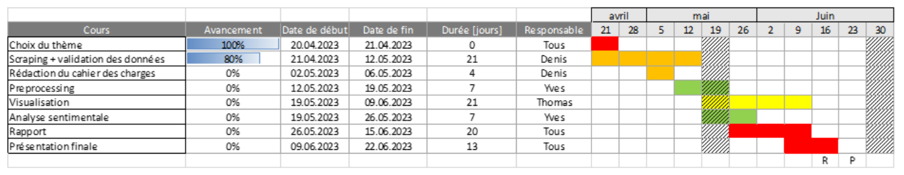

Initially, our project was structured into three distinct parts: scraping, sentiment analysis, and result visualization. Each team member took ownership of one of these components, while also providing assistance to one another when required. As the project progressed, we collectively decided to incorporate a predictive aspect, wherein we aimed to forecast the ratings an episode would receive based on the sentiment expressed in the comments and the number of likes the episode got.
## 8. Conclusion / Improvements

### Conclusion
#### Scraping
We had trouble to get the data we wanted from the site webtoons. We learned the hard way that those kind of site use sophiticated anti-scraping techniques. It's perfectly understandable as they don't want people to steal their data. We had to change our code multiple times to get the data we wanted.
#### Data cleaning
Cleaning the data was a long process. We had a lot of csv to process. We used `polars` to read the csv instead of `pandas`, the same function took 10 seconds instead of 2 minutes. We had to manually add some data that we didn't have time to scrape from the site.
#### Sentiment analysis
We were really surprised by the results, as we can see there is a lot of neutral comments.
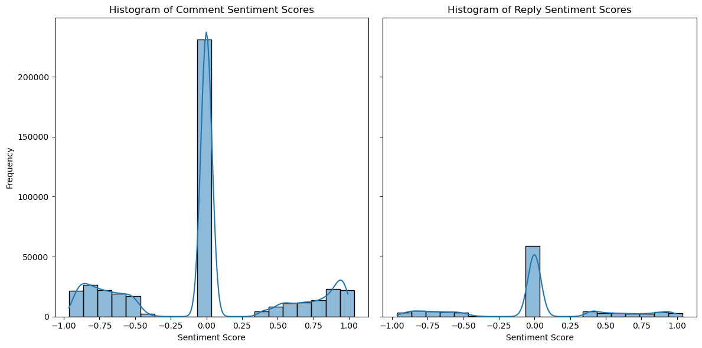 We used the model `cardiffnlp/twitter-roberta-base-sentiment-latest` from [Hugging Face](https://huggingface.co/cardiffnlp/twitter-roberta-base-sentiment-latest) to do the sentiment analysis. We tried the old model `cardiffnlp/twitter-roberta-base-sentiment` but it was very bad. The main flaws are:
- Most comments are about a specific episode of a webtoon. It will be difficult to understand the sentiment of a comment without the context of the episode.
- Some comments are not made by people that writes good english, it's full of spelling mistakes and abbreviations. It's difficult to understand the sentiment of a comment that is not well written.
- The comments are full of irony and sarcasm. The model has a lot of trouble with that.
#### Rating Prediction
The prediction for our model are not far from the reality a mean squared error is low and the r-squared value indicate that the input feature a meaningful for our task.
```shell
Mean Squared Error: 0.11168040618349229
R-squared: 0.9396191575565028
```
We can say that the methode is significatif and could work. With more data we should be more confident but the behaviour of the model with random new data give us a bit of overview of what we expect
```shell
Predicted Note: [8.60898103 8.91794663 9.00201 8.753241 8.57832604 9.11900909 8.53446977 8.74711001 8.75483752 8.85843425]
```
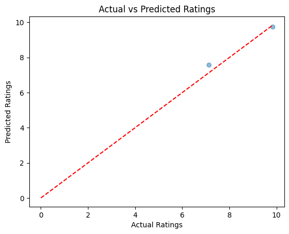

We see on the two webtoon in the test set that the prediction is accurate we could assume that this model fill the purpose to predict the rating prediction but we got too few data to be sure about that
### Improvements
#### Scraping
1. We could improve the scraping process by adding this data that is manually added in the data cleaning process:
    - `Series_Genre`: The genre of the series
    - `Series_Views`: The number of views of the series
    - `Series_Subscribers`: The number of subscribers of the series
    - `Series_Rating`: The rating of the series

2. The scraping took a very long time and we had to do it multiple times because we had to change the code to get the data we wanted. The last try took almost 8 days. We could improve the scraping process by:
    - Scraping the data in parallel
    - Scraping the data in a more efficient way

3. The webtoons site changed some of its code during the scraping process. This means that we had to change our code to get the data we wanted. We could improve the scraping process by:
    - Scraping the data in a more robust way

#### Rating Prediction
1. We could scrap more data to refine the model rating_prediction, it take too much time actually to scrap and analyse one.


2. We try to took in consideration the progress of like and sentiment in each episode but I cannot manage to success with a more complexe model as we got too separate number of episodes by webtoon.

#### Data cleaning
1. Use `polars` everywhere instead of `pandas` for the data cleaning process. It's a lot faster and it's easy to use.

#### Visualisation
1. All of the visualisation might not exactly reflect reality as we only scraped 1 serie per genre. This means we could be drawing the wrong conclusions. The percentage of likes compared to the first episode graph is also a bit messy, maybe there is a better way to visualise the decline of likes over the episodes. 

